<div align="center">

# 🛡️ SAT-SA: Supervisory Analytics Tool for SOC Assessment
### Air-Gapped Supervisory Analytics Platform for Critical Sector Cyber Resilience

**Smart India Hackathon 2026** • **Organization:** National Critical Information Infrastructure Protection Centre (NCIIPC)  
**Team:** Quantum6 • **Problem Statement:** Supervisory Analytics Tool for SOC Assessment (SAT-SA)  
**Quick Links:** [Evaluation Guide](docs/JURY_RUBRIC_DEFENSE.md) • [Full Benchmarks](docs/BENCHMARK.md) • [Architecture Guide](docs/architecture/README.md) • [Validation Report](docs/VALIDATION_REPORT.md) • [CLI Manual](docs/CLI_REFERENCE.md) • [Taxonomy & Rules](docs/PARSERS_TAXONOMY.md)

</div>

<br/>

---

<br/>

### What is SAT-SA?
**SAT-SA (Supervisory Analytics Tool for SOC Assessment)** is an offline, air-gapped supervisory analytics workbench built for **NCIIPC human examiners** to evaluate periodic security submissions (alert metadata, case logs, escalation trails, and asset inventories) across Critical Sector Entities (Power Grids, Banking, Telecom, Defense Enclaves, Transport, and Healthcare).

### Core Capabilities:
* **Dual-Discipline Detection Core:** Automatically exposes **Execution Gaps** (3-min rubber-stamped closures, zero-step tickets, SimHash duplicate triage notes) and unmasks **Negative Space** (silent SCADA/Purdue L1 assets >14 days, missing threat categories, telemetry blackouts).
* **8 Statutory Resilience Capabilities:** Objectively scores entities from 0 to 100 across Threat Detection, Investigation, Escalation, Incident Response, SecOps, Governance, Operational Discipline, and Cyber Resilience.
* **100% Air-Gapped Local AI Copilot:** Synthesizes Section 70A supervisory briefings locally via on-premise Ollama (Qwen 2.5 / Llama 3) with zero cloud dependencies or external API calls.
* **Section 65B Cryptographic Audit Ledger:** Anchors every supervisory decision, batch ingestion, and parameter modification into an immutable SHA-256 sequential hash chain for court-admissible legal validity.
* **Optimized Review Portfolio (85/15 Quota):** Delivers a **3.42× defect discovery lift** over manual random sampling, capturing **88% of real operational weaknesses** in the first 20% review budget.

<br/>

---

<br/>

## 📑 Table of Contents

- [Project Overview & Key Guarantees](#-project-overview--key-guarantees)
- [System Architecture & 5-Tier Dataflow](#-system-architecture--5-tier-dataflow)
- [The 8 Cyber Resilience Capability Dimensions](#-the-8-cyber-resilience-capability-dimensions)
- [Execution Gap & Negative Space Detectors](#-execution-gap--negative-space-detectors)
- [Supervisory Examiner Web Console (React + TypeScript)](#-supervisory-examiner-web-console-react--typescript)
- [Cryptographic Audit Ledger & Section 65B Compliance](#-cryptographic-audit-ledger--section-65b-compliance)
- [Air-Gapped AI Copilot & Local Inference](#-air-gapped-ai-copilot--local-inference)
- [Empirical Benchmarks & Validation Against Manual Review](#-empirical-benchmarks--validation-against-manual-review)
- [Standalone CLI Manual (Headless Examiner Workstation)](#-standalone-cli-manual-headless-examiner-workstation)
- [Explicit Scope Boundaries (What SAT-SA Is NOT)](#-explicit-scope-boundaries-what-sat-sa-is-not)
- [Single-Command Quickstart](#-single-command-quickstart)
- [Team Quantum6 & Statutory Citations](#-team-quantum6--statutory-citations)

<br/>

---

<br/>

## 🎯 Project Overview & Key Guarantees

Traditional regulatory oversight relies on policies, compliance self-attestations, and executive KPI dashboards. When NCIIPC examiners manually inspect operational records, they uncover critical failure modes hidden behind pristine **98% SLA compliance** headlines.

**SAT-SA enforces four core supervisory engineering guarantees:**

| Guarantee | How SAT-SA Enforces It | Supervisory Benefit |
| :--- | :--- | :--- |
| **Operational Reality vs. Paper SLAs** | Correlates alert timestamps, case investigation dossiers, and closure notes against reported metrics. | Exposes metric-satisficing triage behavior, 3-minute closures, and zero-investigation rubber-stamping. |
| **Negative Space Detection** | Poisson probability modeling ($P(k=0 \mid \lambda) < 10^{-9}$) on telemetry heartbeat baselines. | Detects uncatalogued SCADA/OT assets silent >14 days and missing telemetry categories. |
| **100% Air-Gapped Invariant** | Self-contained on-premise execution with local Ollama LLMs and zero remote CDN or cloud APIs. | Guarantees national critical infrastructure security data never leaves the NCIIPC enclave. |
| **Court-Admissible Non-Repudiation** | Sequential SHA-256 hash chaining ($H_n = \text{SHA-256}(H_{n-1} \parallel \text{Payload}_n)$). | Satisfies Section 65B of the Indian Evidence Act (BSA §63) with tamper-evident audit dockets. |

<br/>

---

<br/>

## 🏛️ System Architecture & 5-Tier Dataflow

```mermaid
flowchart LR
    %% Stage 1: Ingestion Tier
    subgraph STAGE1 ["1. Ingestion Tier"]
        direction TB
        CSE["Periodic CSE Submissions<br/>CSV / JSON / Syslog / CEF"]
        PARSER["Stream Parser &<br/>Operator Pseudonymizer"]
        CSE --> PARSER
    end

    %% Stage 2: Forensic Fact Ledger
    subgraph STAGE2 ["2. Fact Ledger"]
        direction TB
        DB[("SQLite WAL DB<br/>Fact & Case Tables")]
        AGG["Rule Registry &<br/>Daily Rollups"]
        DB --> AGG
    end

    %% Stage 3: Supervisory Analytics Core
    subgraph STAGE3 ["3. Analytics Core"]
        direction TB
        EG["Execution Gaps<br/>(EG-01 to EG-06)"]
        NS["Negative Space<br/>(NS-01 to NS-05)"]
        SCORE["Sector Z-Score<br/>(0–100 Index)"]
        EG --> SCORE
        NS --> SCORE
    end

    %% Stage 4: Local AI Copilot
    subgraph STAGE4 ["4. Local AI Copilot"]
        direction TB
        LLM["Local Ollama<br/>Qwen 2.5 / Llama 3"]
        FALLBACK["Deterministic<br/>Rule Fallback"]
        SYNTH["Statutory Section 70A<br/>Narrative Synthesizer"]
        LLM --> SYNTH
        FALLBACK --> SYNTH
    end

    %% Stage 5: Decision Support & Audit
    subgraph STAGE5 ["5. Audit & Governance"]
        direction TB
        QUEUE["85/15 Portfolio<br/>Review Queue"]
        LEDGER[("Section 65B Ledger<br/>SHA-256 Chained")]
        QUEUE --> LEDGER
    end

    PARSER --> DB
    AGG --> EG & NS
    SCORE --> LLM & FALLBACK
    SYNTH --> QUEUE
```



### The 5 Air-Gapped Pipeline Stages:
1. **Stage 1 (Multi-CSE Ingestion):** Ingests structured CSV, JSON, Syslog, or CEF archives from multiple entities. Pseudonymizes analyst identifiers using SHA-256 hashing to protect operator privacy while preserving workflow identity.
2. **Stage 2 (Forensic Fact Ledger):** Commits normalized records into an indexed, local SQLite WAL database. Maintains strict temporal order across alert creation, triage start, case assignment, and closure.
3. **Stage 3 (Dual-Engine Supervisory Analytics):** Executes 11 statistical and heuristic detectors uncovering both Execution Gaps and Negative Space. Computes median and Median Absolute Deviation (MAD) sector baselines.
4. **Stage 4 (Local Air-Gapped AI Copilot):** Evaluates aggregated evidence through local Ollama LLMs (`qwen2.5:3b` / `llama3.2:3b`) on `localhost:11434`. Automatically generates Section 70A executive summaries and root-cause analyses without cloud connectivity.
5. **Stage 5 (Decision Support & Audit Ledger):** Populates the Neyman-stratified **85% Priority / 15% Exploration** supervisory review queue and seals all findings into the Section 65B cryptographic ledger.

<br/>

---

<br/>

## 🎯 The 8 Cyber Resilience Capability Dimensions

SAT-SA evaluates periodic evidence against the 8 statutory capabilities defined in the NCIIPC problem statement:

| # | Statutory Capability | Operational Supervisory Focus | SAT-SA Evaluation Metric |
|:--:|:---|:---|:---|
| **(i)** | **Threat Detection** | Ingestion completeness, detection rule coverage, and dark-space ratio. | Detection Deficit Index, Absent Threat Categories (NS-02). |
| **(ii)** | **Investigation** | Triage discipline, investigative artifact collection, and root-cause recording. | Zero-Step Ratio (EG-03), Evidence Quality Score (0–100). |
| **(iii)** | **Escalation** | Tier-1 to Tier-2 escalation fidelity and CIRT dispatch on critical triggers. | Unescalated Critical Incident Ratio (EG-02). |
| **(iv)** | **Incident Response** | Containment SLA adherence, dynamic playbook execution, and breach mitigation. | Mean Time to Contain (MTTC), Repeat Asset Breaches (EG-05). |
| **(v)** | **Security Operations** | 24/7 SOC staffing resilience, shift-handover integrity, and queue health. | Shift Handover Anomaly Index, Weekend Alert Triage Drift. |
| **(vi)** | **Governance & Oversight** | Statutory compliance tracking, executive escalation, and policy verification. | Supervisory Attention Score, Form SAR-01 Dossier Issuance. |
| **(vii)** | **Operational Discipline** | Resistance to fast-close KPI gaming and unvalidated mass closures. | Fast Closure Ratio (<10m) (EG-01), SimHash Duplicate Notes (EG-04). |
| **(viii)** | **Cyber Resilience** | Survivability, disaster recovery telemetry, and critical asset visibility. | Silent Critical Asset Window (NS-01), Purdue Model L1/L2 Uptime. |

<br/>

---

<br/>

## 🔍 Execution Gap & Negative Space Detectors

SAT-SA operationalizes 11 specialized algorithmic detectors across two complementary supervisory disciplines:

### Category A: Execution Gap Detectors (Policy vs. Reality)
* **EG-01 (Rapid Sub-Threshold Closures):** Identifies critical alerts closed in `<10 minutes` (often `<3 minutes`) with generic closure notes to game contractual response SLAs.
* **EG-02 (Unescalated Critical Threats):** Flags high/critical severity security alerts closed directly at L1 operator triage without mandatory L2 or CIRT incident escalation records.
* **EG-03 (Zero-Step Acknowledged Tickets):** Detects alerts marked "Investigated" where the case dossier contains zero logged forensic diagnostic steps, artifact attachments, or query records.
* **EG-04 (High Lexical Duplication / Boilerplate Triage):** Employs **SimHash 64-bit locality-sensitive hashing** with Hamming distance $\le 3$ to detect automated copy-pasting of identical investigation notes across unrelated incidents.
* **EG-05 (Repeat Breaches Without Root-Cause Remediation):** Pinpoints critical infrastructure assets experiencing recurrent high-severity alarms (>10 cycles) without recorded configuration changes or root-cause fixes.
* **EG-06 (Metric-Driven SLA Bunching):** Discovers artificial closure spikes occurring precisely between minutes 54 and 59 of a 60-minute SLA window, exposing metric-satisficing triage behavior.

### Category B: Negative Space Reasoners (Absent Evidence)
* **NS-01 (Silent Critical Assets):** Employs lower-tail Poisson probability analysis ($P(k=0 \mid \lambda) < 10^{-9}$) to identify mission-critical Purdue Model L1/L2 SCADA nodes and Active Directory domain controllers with zero telemetry for `>14 days`.
* **NS-02 (Missing Sectoral Threat Categories):** Evaluates absence of mandatory threat classes (e.g., zero Credential Dumping or Privilege Escalation alerts over 90 days in an enterprise bank).
* **NS-03 (High-Severity Alerts Missing Case Records):** Cross-references alert streams against case-management tables to uncover critical alarms closed without generating case tickets.
* **NS-04 (Cross-Entity Peer Outlier Deviations):** Calculates robust modified z-scores ($M_i = 0.6745 \cdot (x_i - \tilde{x}) / \text{MAD}$) to flag entities whose triage volumes diverge abnormally from peer sector medians.
* **NS-05 (Telemetry Silence Blackout Windows):** Detects abrupt multi-hour drop-offs in event reporting indicating sensor crashes or intentional log-forwarding blackouts.

<br/>

---

<br/>

## 🖥️ Supervisory Examiner Web Console (React + TypeScript)

Crafted with high-contrast slate styling, zero external CDN dependencies, and Vanilla CSS design tokens (100% air-gap compliant):

* **Landing Command Center:** 4-Pillar Mandate Cards, interactive 5-Stage Ingestion Flow, and empirical benchmarks.
* **Entity Attention Ranking Heatmap:** Prioritizes Critical Sector Entities from highest to lowest risk based on operational evidence.
* **Reported KPIs vs. Underlying Evidence Workbench:** Exposes the Discrepancy Gap between self-reported headline SLAs and forensic ground truth.
* **Interactive 8-Dimension Radar & Pie Distribution:** Mathematical color-linked visualization of national capability bottlenecks.
* **Silent Critical Assets Radar:** Deep-dive inspector for unmonitored SCADA, PLC, and core banking infrastructure.
* **Prioritized Review Queue (85/15 Stratified Portfolio):** Triage workflow allowing examiners to inspect raw logs, add remarks, and confirm defects.
* **Form SAR-01 Dossier Modal:** Generates official Section 70A Statutory Cyber Resilience Reports with color-coded supervisory tokenization and 1-click printing.

<br/>

---

<br/>

## 🔒 Cryptographic Audit Ledger & Section 65B Compliance

Every supervisory action—batch ingestion, defect confirmation, sanction issuance, and threshold tuning—is cryptographically anchored in a **sequential SHA-256 hash chain**:

```text
Hash[n] = SHA-256( Hash[n-1] || Action || Entity_ID || Payload_JSON || ISO8601_Timestamp )
```

* **Immediate Tamper Detection:** Modifying a single character or timestamp in the database breaks every subsequent hash in the ledger, instantly flagging the exact corrupted block.
* **Indian Evidence Act §65B (BSA §63):** Produces cryptographic verification certificates admissible in legal and regulatory enforcement proceedings.
* **Instant Verification:** The entire ledger verifies in `<5 ms` via `crypto.timingSafeEqual`.

<br/>

---

<br/>

## 🤖 Air-Gapped AI Copilot & Local Inference

SAT-SA includes an embedded, sovereign AI Copilot operating strictly on **`localhost:11434`** via **Ollama**:

* **Supported Local Models:** `qwen2.5:3b` (Default, ultra-fast), `llama3.2:3b`, `mistral:7b`.
* **Zero Cloud Dependencies:** No external API keys, internet connections, or third-party SaaS dependencies.
* **Deterministic Fallback Engine:** If the local Ollama daemon is offline or uninstalled, SAT-SA seamlessly defaults to a deterministic heuristic synthesizer without throwing errors or interrupting audits.
* **Structured Regulatory Briefings:** Formulates Executive Assessments, Forensic Weakness Analyses, and Statutory Directives under NCIIPC Section 70A.

<br/>

---

<br/>

## ⚡ Empirical Benchmarks & Validation Against Manual Review

Evaluated against authentic and simulated manual sampling baselines across **535,500+ records**:

| Metric | Measured Result | Supervisory Significance |
| :--- | :---: | :--- |
| **Defect Sampling Lift Multiplier** | **3.42× Yield** | Surfaces 34 true operational gaps vs. 10 per 100 reviewed cases under uniform random review. |
| **Defect Recall @ 20% Budget** | **88.0%** | Captures 88% of all true defects within the first 20% examiner review budget (random review captures only 20%). |
| **Inspection Prep Velocity** | **93.3% Faster** | Slashes audit triage preparation from 42 hours to 2.8 hours per 10,000 alert records. |
| **Clean Cohort False Alarm Rate** | **4.8%** | Robust resilience against false positives on compliant entities, benchmarked via Median and MAD. |
| **Streaming Ingestion Velocity** | **24,800 EPS** | Ingests, parses, and normalizes multi-format CSV/JSON logs on a single CPU core. |
| **Detection Engine Latency** | **< 118 ms** | Evaluates all 11 dual-discipline detectors across 50,000 logs in under 118 milliseconds. |
| **RAM Footprint Invariant** | **~58 MB RSS** | Strict memory safety with zero memory leaks across sustained 500k-log runs. |

<br/>

---

<br/>

## 💻 Standalone CLI Manual (Headless Examiner Workstation)

For air-gapped forensic jump boxes, SAT-SA operates as a zero-dependency CLI executable:

```bash
# 1. Run full statutory audit on all monitored entities
node backend/bin/satsa.js audit

# 2. Inspect a specific Critical Sector Entity
node backend/bin/satsa.js audit --entity CSE-POWER-01

# 3. Dump the 85/15 prioritized review queue
node backend/bin/satsa.js queue --limit 20

# 4. Verify cryptographic SHA-256 hash chain integrity
node backend/bin/satsa.js verify-chain

# 5. Run live adversarial tamper attack simulation
node backend/scripts/tamper_demo.js

# 6. Execute 500k-record empirical benchmark suite
node backend/bin/satsa.js benchmark
```

<br/>

---

<br/>

## ⚠️ Explicit Scope Boundaries (What SAT-SA Is NOT)

As mandated by NCIIPC Problem Statement §1, SAT-SA strictly enforces these functional boundaries:

1. **NOT a Security Operations Centre (SOC):** Does not triage real-time alerts or coordinate tactical firewall blocklists.
2. **NOT a Real-Time Monitor:** Operates on periodic batch submissions (weekly/monthly/quarterly), not continuous live streams.
3. **NOT a SIEM Platform:** Does not replace Splunk, QRadar, or Microsoft Sentinel inside CSE networks.
4. **NOT a Centralized SOC:** Does not centralize multi-tenant security operations.
5. **NOT a Packet Sniffer / Live Log Collector:** Minimizes dependence on raw payloads, focusing strictly on alert metadata, case logs, and asset registries.

<br/>

---

<br/>

## 🚀 Single-Command Quickstart

### Option 1: Local Bare-Metal Execution (Recommended)

```bash
# 1. Start the Backend API Server (Port 5000)
cd backend
npm install
npm start

# 2. In a second terminal, start the Frontend Dev Server (Port 5173)
cd frontend
npm install
npm run dev
```
* **Supervisory Web Console:** [http://localhost:5173](http://localhost:5173)
* **Backend API Health Check:** [http://localhost:5000/api/v1/health](http://localhost:5000/api/v1/health)

### Option 2: Docker Compose

```bash
docker compose up --build
```

<br/>

---

<br/>

## 👥 Team Quantum6 & Statutory Citations

* **Hackathon:** Smart India Hackathon 2026
* **Organization:** National Critical Information Infrastructure Protection Centre (NCIIPC)
* **Team Name:** Quantum6
* **Legal Citations & Regulatory References:**
  - Section 70A, Information Technology Act, 2000 (NCIIPC Designation & Mandate)
  - Section 70B, Information Technology Act, 2000 (Incident Reporting & Cyber Security)
  - Section 65B, Indian Evidence Act / Section 63, Bharatiya Sakshya Adhiniyam, 2023 (BSA) (Admissibility of Electronic Records)
  - NCIIPC Guidelines for the Protection of Critical Information Infrastructure (Version 2.4)
* **License:** This project is licensed under the [MIT License](LICENSE).

<br/>

<div align="center">

### Built for Smart India Hackathon 2026
**National Critical Information Infrastructure Protection Centre (NCIIPC)**  
*Developed by Team Quantum6.*

</div>
