# 🛡️ SAT-SA Jury Defense & Evaluation Cheat Sheet
### **National Critical Information Infrastructure Protection Centre (NCIIPC) • SIH 2026 (PS: SIH26157)**
### **Title: Supervisory Analytics Tool for SOC Assessment (SAT-SA)**

> **[⬅ Return to Main README.md](../README.md)** &nbsp;|&nbsp; **[View CLI Manual](CLI_REFERENCE.md)** &nbsp;|&nbsp; **[View Empirical Benchmark](BENCHMARK.md)** &nbsp;|&nbsp; **[View Detector Taxonomy](PARSERS_TAXONOMY.md)**

This document provides a comprehensive **Requirement-to-Feature Evaluation Matrix** mapping every official NCIIPC problem statement clause and Section 7 Performance Criterion to our implementation, mathematical formulations, CLI verification commands, and audit defense proofs.

---

## 📋 Section 7 Performance Criteria Matrix

| # | Official NCIIPC Criterion | Weight & Focus | SAT-SA Engineering Implementation | Evaluator Verification Command / Proof |
|:---:|---|:---:|---|---|
| **1** | **Ability to Support Supervisory Assessment** | **Core Foundation** | Assesses periodic alert, investigation, and escalation records across **8 Cyber Resilience Dimensions**. Computes a normalized **0–100 Composite Attention Score** to rank entities objectively. | `node backend/bin/satsa.js audit`<br/>Web: **Entity Attention Matrix (Heatmap)**<br/>[📄 View Architecture ↗](architecture/README.md) |
| **2** | **Detection of Execution Gaps** | **Primary Innovation** | Autonomous detectors for **6 Execution Gaps (EG-01 to EG-06)**: Fast rubber-stamped closures (<10m), unescalated critical alerts, zero-step tickets, SimHash 64-bit template copying, unremediated repeat alerts, and SLA bunching. | `node backend/bin/satsa.js audit --entity CSE-POWER-01`<br/>Web: **Headline KPIs vs Evidence Drilldown**<br/>[📄 View Detectors Taxonomy ↗](PARSERS_TAXONOMY.md) |
| **3** | **Detection of Negative Space** | **Primary Innovation** | Mathematical models exposing **Negative Space (NS-01 to NS-05)**: High-criticality silent assets (SCADA/AD >14d, Poisson $P < 10^{-9}$), absent threat categories, unfiled case records, and abnormal velocity drops. | `node backend/bin/satsa.js audit --entity CSE-POWER-01`<br/>Web: **Silent Critical Assets Inspector**<br/>[📄 View Detectors Taxonomy ↗](PARSERS_TAXONOMY.md) |
| **4** | **Explainability and Auditability** | **Legal Admissibility** | Every finding provides full drill-down: **Why Flagged rationale**, raw JSON evidence records, and Section 65B BSA court-admissible **SHA-256 Chained Decision Ledger** ($H_n = \text{SHA-256}(H_{n-1} \parallel \text{Finding}_n \parallel T_n)$). | `node backend/scripts/tamper_demo.js`<br/>`node backend/bin/satsa.js verify-chain`<br/>[📄 View Claims Defense ↗](CLAIMS_VERIFICATION_DEFENSE.md) |
| **5** | **Scalability & Air-Gapped Performance** | **Enterprise Scale** | 100% offline native architecture. Zero internet / cloud calls. Embedded SQLite WAL engine + streaming chunk ingestion handling **535,500+ records at 24,800 EPS** with strict $O(1)$ ~58 MB RAM footprint. | Disconnect network adapter $\rightarrow$ CLI and UI execute flawlessly offline.<br/>`node backend/bin/satsa.js benchmark`<br/>[📄 View Empirical Benchmark ↗](BENCHMARK.md) |
| **6** | **Innovation & Additional Supervisory Insights** | **Supervisory Value** | **SimHash 64-bit lexical fingerprinting**, **Neyman-stratified 85% Priority / 15% Exploration Triage Queue**, Peer Median MAD robust outlier statistics, and interactive **"What-If" Scenario Studio**. | `node backend/bin/satsa.js queue --limit 15`<br/>Web: **Supervisory Review Queue**<br/>[📄 View CLI Manual ↗](CLI_REFERENCE.md) |

---

## 🎯 The 8 Supervisory Capability Dimensions Evaluated

Under NCIIPC mandate, SAT-SA does not monitor live attacks; instead, it uses operational data as supervisory evidence across 8 dimensions:

```mermaid
graph TD
    subgraph DIMS["8 Cyber Resilience Capability Dimensions (NCIIPC Framework)"]
        D1["1. Threat Detection (Detection)"]
        D2["2. Investigation & Triage (Investigation)"]
        D3["3. Escalation Integrity (Escalation)"]
        D4["4. Incident Response & MTTR (IncidentResponse)"]
        D5["5. Security Operations Discipline (SecOps)"]
        D6["6. Governance & Oversight (Governance)"]
        D7["7. Operational Discipline (Discipline)"]
        D8["8. Cyber Resilience & Coverage (Resilience)"]
    end

    subgraph DETECT["Supervisory Analytics Detectors"]
        EG1["EG-01: Fast Critical Closures (<10 min)"]
        EG2["EG-02: Critical Closed Without Escalation"]
        EG3["EG-03: Zero-Step Acknowledged Tickets"]
        EG4["EG-04: SimHash Lexical Template Copying"]
        EG5["EG-05: Repeat Alerts Without Mitigation"]
        EG6["EG-06: Metric-Driven SLA Bunching"]
        NS1["NS-01: Silent SCADA / AD Assets (>14 Days)"]
        NS2["NS-02: Missing Expected Threat Categories"]
        NS3["NS-03: Missing Case Management Records"]
        NS5["NS-05: Abnormally Low Alert Velocity"]
    end

    D1 --> NS2
    D1 --> NS5
    D2 --> EG1
    D2 --> EG3
    D2 --> NS3
    D3 --> EG2
    D4 --> EG5
    D7 --> EG4
    D7 --> EG6
    D8 --> NS1
```



---

## 🔬 Scientific & Algorithmic Defense

### 1. SimHash 64-Bit Lexical Fingerprinting (EG-04)
To detect superficial copy-paste analyst notes designed to game ticket closure metrics without actual triage:
$$\text{SimHash}(D) = \sum_{w \in D} \text{weight}(w) \cdot \text{hash}_{64}(w)$$
Notes with Hamming distance $d_H(h_1, h_2) \le 3$ are flagged as near-duplicate boilerplate closures.

### 2. Poisson Probability for Silent Critical Infrastructure Assets (NS-01)
Given historical alert arrival rate $\lambda$ events/day over historical baseline:
$$P(k = 0 \text{ alerts over } t \text{ days} \mid \lambda) = e^{-\lambda t}$$
For critical assets with $\lambda = 2.4 \text{ alerts/day}$, zero alerts over $t = 14 \text{ days}$ yields $P = e^{-33.6} \approx 2.5 \times 10^{-15}$, mathematically disproving benign behavior and establishing telemetry failure or sensor blind spots.

### 3. Modified Z-Score Peer Benchmarking (Robust Against Outliers)
$$\text{Modified } Z_i = \frac{0.6745 \cdot (x_i - \tilde{x})}{\text{MAD}}$$
Where $\tilde{x} = \text{median}(X)$ and $\text{MAD} = \text{median}(|x_i - \tilde{x}|)$. Avoids skew from heavily compromised or dysfunctional outlier entities.

### 4. Neyman-Stratified 85% Priority / 15% Exploration Queue
Allocates 85% of supervisory audit capacity to high-risk anomaly clusters, and 15% to stratified random sampling across clean cohorts to prevent adversarial blind spots.

---

## 🏆 Standalone Evaluator Commands

```bash
# 1. Audit Northern Regional Power Grid (exposes fast closures, silent RTUs, unescalated alerts)
node backend/bin/satsa.js audit --entity CSE-POWER-01

# 2. Audit Clean Control Cohort (Apex National Commercial Bank)
node backend/bin/satsa.js audit --entity CSE-BANK-01

# 3. Inspect Neyman-Stratified Review Queue (85% priority / 15% exploration)
node backend/bin/satsa.js queue --limit 15

# 4. Run Section 65B BSA Tamper-Proof Cryptographic Verification
node backend/bin/satsa.js verify-chain

# 5. Execute Section 8 Empirical Benchmark (535,500 records, 3.42x lift proof)
node backend/bin/satsa.js benchmark

# 6. Run Tamper Attack & Detection Simulation
node backend/scripts/tamper_demo.js
```
