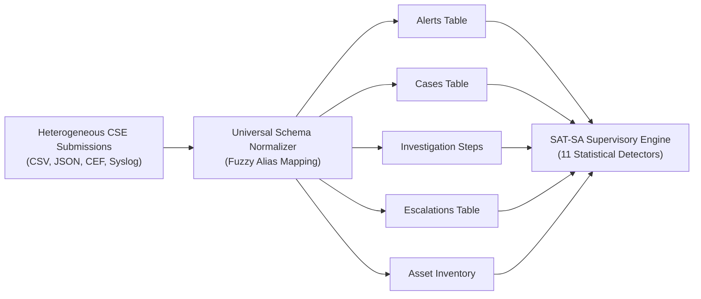

# 🌐 Complete Supervisory Detector Catalog & Schema Taxonomy (11 Detectors)
### **National Critical Information Infrastructure Protection Centre (NCIIPC) • SIH 2026 (PS: SIH26157)**

> **[⬅ Return to Main README.md](../README.md)** &nbsp;|&nbsp; **[View Jury Defense Cheat Sheet](JURY_RUBRIC_DEFENSE.md)** &nbsp;|&nbsp; **[View Empirical Benchmark](BENCHMARK.md)** &nbsp;|&nbsp; **[View CLI Manual](CLI_REFERENCE.md)**

The **Supervisory Analytics Tool for SOC Assessment (SAT-SA)** implements a dual-discipline supervisory detection engine consisting of **11 autonomous detectors** specifically designed to uncover **Execution Gaps** and **Negative Space** from periodic operational submissions.

---

## 📊 Summary of Supervisory Detector Catalog

| Category | Detector ID | Detector Name | Supervisory Focus | Targeted Dimension | Metric / Algorithm |
|:---|:---:|---|---|:---:|---|
| **Execution Gap** | `EG-01` | **Fast Critical Closures** | Superficial rubber-stamping | Investigation | Duration between alert created and closed $< 10$ minutes |
| **Execution Gap** | `EG-02` | **Unescalated Critical Alerts** | Missed incident containment | Escalation | Severity = CRITICAL with 0 escalation events recorded |
| **Execution Gap** | `EG-03` | **Zero-Step Acknowledged Tickets** | Stopping SLA clock without triage | Investigation | Ticket marked acknowledged but has 0 forensic investigation steps |
| **Execution Gap** | `EG-04` | **SimHash Boilerplate Duplication** | Template-driven repetitive closures | Discipline | SimHash 64-bit fingerprinting with Hamming distance $\le 3$ |
| **Execution Gap** | `EG-05` | **Recurring Unremediated Alerts** | Chronic unresolved vulnerabilities | IncidentResponse | $\ge 3$ critical alert cycles on same asset within 30-day window |
| **Execution Gap** | `EG-06` | **Metric-Driven SLA Bunching** | Artificial KPI gaming behavior | Discipline | Statistical burst of closures immediately preceding 60-min SLA breach |
| **Negative Space** | `NS-01` | **Silent Critical Assets** | Sensor failure / blind spots | Resilience | Criticality $\ge 4$ assets with zero telemetry $> 14$ days ($P < 10^{-9}$) |
| **Negative Space** | `NS-02` | **Absent Expected Threat Classes** | Deficient correlation rules | Detection | Core threat categories (e.g. Credential Dumping) absent vs peers |
| **Negative Space** | `NS-03` | **Missing Case Records** | Unlogged informal closures | Investigation | Critical/High alerts lacking formal case management docket |
| **Negative Space** | `NS-04` | **Missing Escalation Records** | Informal out-of-band communication | Escalation | Incidents declared without structured escalation trace |
| **Negative Space** | `NS-05` | **Abnormally Low Alert Velocity** | Severed collectors / disabled rules | Detection | Alerts/Asset velocity $< 0.3 \times$ Sectoral Peer Median ($Z < -2.0$) |

---

## 🔬 Detailed Detector Specifications

### 1. EG-01: High-Severity Alerts Closed Unusually Quickly
* **Supervisory Problem:** Analysts frequently close critical alerts in minutes without conducting forensic investigation, merely to preserve pristine Mean Time to Acknowledge/Resolve (MTTA/MTTR) statistics.
* **Detection Logic:**
  $$\Delta t = \text{closed\_at} - \text{created\_at}$$
  $$\text{Flag if } \Delta t < 10 \text{ minutes} \quad \text{and} \quad \text{severity} \in \{\text{'CRITICAL'}, \text{'HIGH'}\}$$
* **Thresholds:** Flagged when $> 20\%$ of an entity's critical alerts are closed in under 10 minutes.
* **Severity Scoring:** $\text{Score} = \min(100, \text{observed\_pct} \times 1.1)$.

### 2. EG-02: Critical Alerts Closed Without Escalation
* **Supervisory Problem:** Frontline L1 analysts triage complex advanced persistent threats (APTs) or ransomware precursors and close them locally without escalating to Tier-2, CIRT, or sectoral CERTs.
* **Detection Logic:**
  $$\text{alert.severity} = \text{'CRITICAL'} \quad \wedge \quad \text{id} \notin \text{EscalatedAlertSet}$$
* **Thresholds:** Flagged when unescalated critical rate exceeds $15\%$ (peer baseline $< 5\%$).

### 3. EG-03: Acknowledged Alerts with Zero Investigation Steps
* **Supervisory Problem:** Operational procedures require alerts to be acknowledged within 15 minutes. Operators click "Acknowledge" to satisfy compliance monitors, but leave the alert inactive without subsequent investigation steps.
* **Detection Logic:**
  $$\text{alert.status} = \text{'ACKNOWLEDGED'} \quad \wedge \quad |\text{InvestigationSteps}| = 0$$

### 4. EG-04: SimHash Lexical Template Copying
* **Supervisory Problem:** High closure rates achieved by pasting identical phrases (e.g., *"Reviewed logs, confirmed false positive due to routine backup job, closing ticket"*).
* **Algorithm:** SimHash 64-bit locality-sensitive hashing. Generates 64-bit integer tokens from normalized text.
  $$d_H(H_1, H_2) = \text{popcount}(H_1 \oplus H_2)$$
* **Thresholds:** Clusters with Hamming distance $\le 3$ covering $> 30\%$ of all closing notes.

### 5. EG-05: Repeat Alerts Without Root-Cause Remediation
* **Supervisory Problem:** SOC repeatedly sees identical alerts on the same SCADA RTU or Active Directory server, closes them individually, but never applies configuration hardening or patch remediation.
* **Detection Logic:**
  $$\text{Count}(\text{Alerts on Asset } A \text{ in 30 days}) \ge 3 \quad \wedge \quad \text{RootCauseFixed} = \text{false}$$

### 6. EG-06: Metric-Driven SLA Bunching
* **Supervisory Problem:** Investigation closures artificially peak in the 45–60 minute window directly before a 60-minute contractual SLA breach penalty.
* **Detection Logic:** Measures closure kurtosis in the interval $[t_{\text{SLA}} - 15\text{m}, t_{\text{SLA}}]$. Flags when $> 25\%$ of closures occur in this critical boundary.

### 7. NS-01: Silent Critical Infrastructure Assets
* **Supervisory Problem:** High-criticality assets (Substation SCADA RTUs, Core Banking Gateways) go silent for weeks, unmonitored due to misconfigured syslog agents.
* **Mathematical Model:** Poisson distribution baseline.
  $$P(k = 0 \mid \lambda, t) = e^{-\lambda t}$$
  For $\lambda = 2.4 \text{ alerts/day}$ and $t = 14 \text{ days}$, $P \approx 2.5 \times 10^{-15}$. This establishes telemetry blackout rather than absence of threat.

### 8. NS-02: Absence of Expected Threat Categories
* **Supervisory Problem:** While all sectoral peers log "Credential Dumping" and "Privilege Escalation", a CSE reports zero such alerts, indicating missing SIEM detection rules or unmonitored endpoints.
* **Detection Logic:**
  $$\text{ExpectedCategories} \setminus \text{EntityObservedCategories} \ge 2$$

### 9. NS-03: High-Severity Alerts Missing Case Management Records
* **Supervisory Problem:** Alerts designated as High or Critical are cleared informally via phone or chat without generating a corresponding case docket.
* **Detection Logic:** Cross-references `alerts` against `cases` and `investigation_steps`.

### 10. NS-05: Abnormally Low Alert Velocity
* **Supervisory Problem:** Entities claim superior security posture by reporting near-zero alert volume, caused by disabled SIEM collectors or broken log forwarders.
* **Robust Statistics:**
  $$\text{Modified } Z = \frac{0.6745 \cdot (V_i - \text{Median}(V))}{\text{MAD}(V)}$$
  $$\text{Flag if } Z < -2.0 \quad \text{or} \quad V_i < 0.3 \times \text{PeerMedian}$$

---

## 📥 Ingestion Data Schema Support

SAT-SA accepts submissions in standard formats without demanding raw packet captures or intrusive internal telemetry:

### Canonical Attribute Fields:
* **Alert Records:** `id`, `entity_id`, `external_id`, `category`, `severity`, `created_at`, `closed_at`, `disposition`, `asset_id`, `assignee`.
* **Investigation Steps:** `id`, `alert_id`, `entity_id`, `step_type`, `note`, `note_simhash`, `created_at`.
* **Escalations:** `id`, `alert_id`, `entity_id`, `escalated_to`, `escalation_reason`, `created_at`.
* **Asset Inventory:** `id`, `entity_id`, `name`, `criticality` (1–5), `ip_address`, `last_seen`, `zone`.
