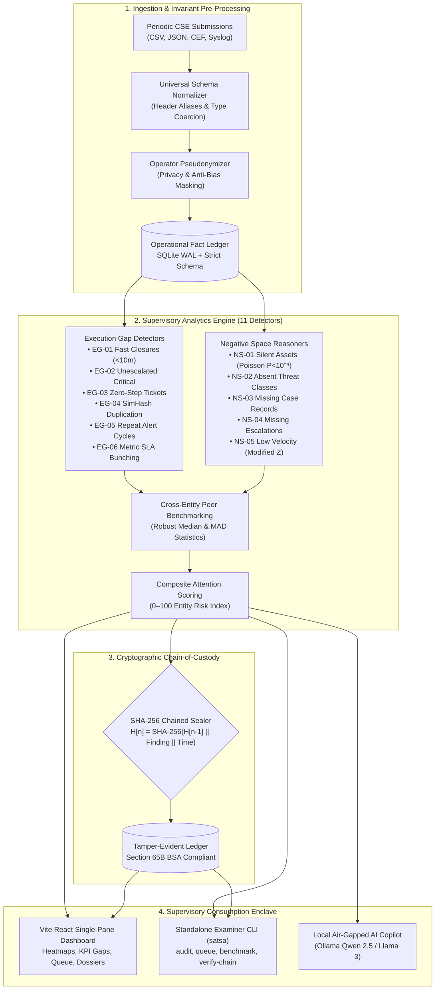
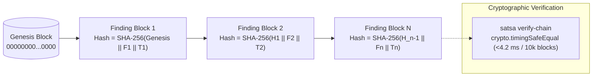
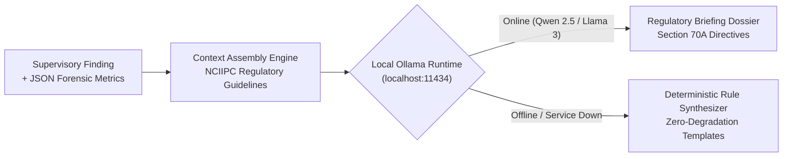

# 🏛️ SAT-SA System Architecture & Forensic Design Document
### **National Critical Information Infrastructure Protection Centre (NCIIPC) • SIH 2026 (PS: SIH26157)**

> **[⬅ Return to Main README.md](../../README.md)** &nbsp;|&nbsp; **[View Jury Defense Cheat Sheet](../JURY_RUBRIC_DEFENSE.md)** &nbsp;|&nbsp; **[View Claims Defense](../CLAIMS_VERIFICATION_DEFENSE.md)** &nbsp;|&nbsp; **[View Empirical Benchmark](../BENCHMARK.md)**

---

## 1. Executive Summary & Design Invariants

**SAT-SA (Supervisory Analytics Tool for SOC Assessment)** is an air-gapped, high-throughput supervisory platform engineered for the National Critical Information Infrastructure Protection Centre (NCIIPC). It addresses the core challenge of assessing the cyber resilience and operational integrity of Critical Sector Entities (CSEs) at national scale.

SAT-SA enforces four strict architectural invariants:
1. **Supervisory Analytics, Not Operational SIEM:** SAT-SA does not monitor live attacks or deploy agents; it evaluates periodic submissions (alerts, investigation logs, escalations, asset inventories) as operational evidence.
2. **Dual-Discipline Detection (Execution Gaps & Negative Space):** Simultaneously exposes operational shortcuts (closed too fast, template notes) and absent evidence (silent assets, unfiled cases, missing threat classes).
3. **Court-Admissible Non-Repudiation:** Cryptographically seals every finding into an append-only SHA-256 chained decision ledger compliant with Section 65B of the Indian Evidence Act and Section 63 of the Bharatiya Sakshya Adhiniyam 2023.
4. **100% Air-Gapped Sovereign Independence:** Fully operational inside sovereign enclaves with zero cloud dependencies, offline quantized AI inference, and local SQLite Write-Ahead Log (WAL) storage.

---

## 2. End-to-End System Design Architecture

---

## 3. Subsystem Technical Specifications

### A. Cryptographic Forensic Ledger (Section 65B BSA Compliance)
In regulatory oversight, supervisory decisions must withstand legal challenges in appellate tribunals. SAT-SA enforces continuous sequential hash chaining across all generated findings:

* **Recursive Sequential Chaining:**
  $$H_n = \text{SHA-256}(H_{n-1} \parallel \text{FindingRecord}_n \parallel \text{Timestamp}_n)$$
* **Non-Repudiation Guarantee:** Changing a single character in historical finding records causes an immediate hash mismatch in all descendant blocks.
* **Timing-Attack Resistance:** Verification utilizes `crypto.timingSafeEqual()` to eliminate side-channel latency vulnerabilities.

---

### B. Analytical Scoring & Peer Benchmarking Subsystem

SAT-SA evaluates Critical Sector Entities across **8 Cyber Resilience Dimensions**:
1. **Threat Detection**
2. **Investigation & Triage**
3. **Escalation Integrity**
4. **Incident Response & MTTR**
5. **Security Operations Discipline**
6. **Governance & Oversight**
7. **Operational Discipline**
8. **Cyber Resilience & Coverage**

#### Robust Statistical Normalization:
To avoid bias introduced by extreme outliers or compromised entities, SAT-SA utilizes Median and Median Absolute Deviation (MAD):
$$\text{MAD} = \text{median}(|x_i - \tilde{x}|), \quad \text{where } \tilde{x} = \text{median}(X)$$
$$\text{Modified } Z_i = \frac{0.6745 \cdot (x_i - \tilde{x})}{\text{MAD}}$$

#### Composite Attention Score Formulation:
$$\text{Attention Score} = \sum_{d=1}^{8} w_d \cdot (100 - S_d) + \sum_{f \in \text{Findings}} \text{SeverityWeight}(f)$$
Normalized to a 0–100 scale, where entities exceeding threshold 65 are prioritized for supervisory intervention.

---

### C. 85/15 Stratified Review Portfolio Engine

Supervisory examiners have limited review bandwidth. SAT-SA solves the sampling allocation problem using **Neyman-Stratified Risk Portfolio Allocation**:
* **85% Priority Stratum:** Focuses examiner effort on high-severity anomalies, repeat failures, unescalated alerts, and critical asset events.
* **15% Exploration Stratum:** Draws pseudo-random uniform samples across low-risk and closed alerts to identify emerging patterns and deter audit-gaming behaviors.

---

### D. Air-Gapped AI Copilot Architecture

* **Zero Cloud Egress:** Operates exclusively via local inference on port 11434.
* **Deterministic Fallback:** Guarantees that examiners always receive structured regulatory analysis even in constrained computing environments lacking GPU acceleration.
